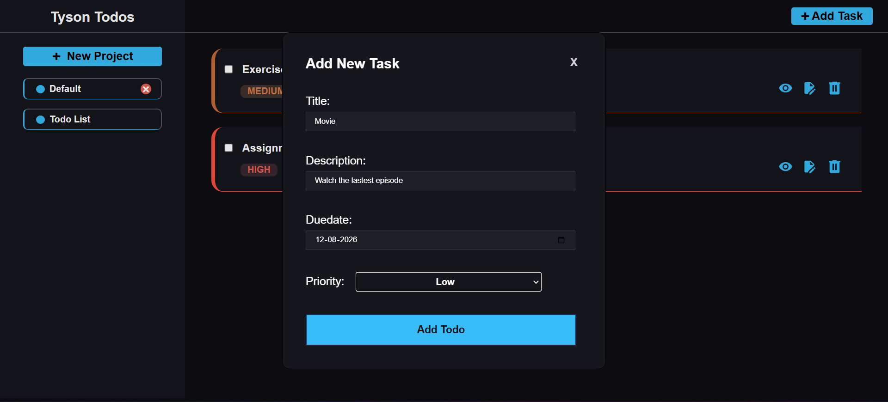
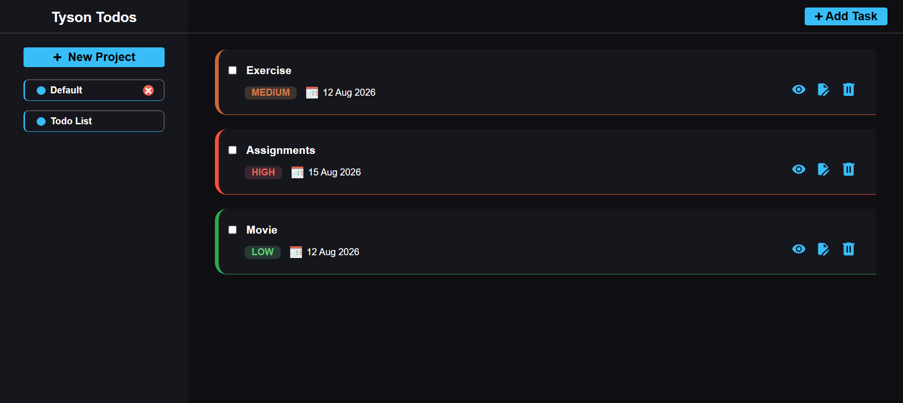

# 📝 Todo List

A feature-rich Todo List application built as part of [The Odin Project](https://www.theodinproject.com/) JavaScript curriculum.

## 🚀 Live Demo

🔗 [View the live application](https://mitrarup.github.io/Todo-List/)

## 📸 Preview





## 📌 Features

### ✅ Core Functionality

-  Create and manage multiple projects
-  Add todos to individual projects
-  Edit todo details
-  Mark todos as completed
-  Delete todos with confirmation
-  View detailed todo information
-  Set todo priority
-  Set due dates

### 💾 Data Persistence

-  Store projects and todos using LocalStorage
-  Restore saved data when the application loads
-  Persist the currently selected project

## 🛠️ Built With

-  HTML5
-  CSS3
-  JavaScript (ES6+)
-  Webpack
-  date-fns
-  LocalStorage

## 📚 What I Learned

-  Managing application state using JavaScript modules
-  Organizing code using ES6 modules
-  DOM manipulation and event delegation
-  Working with classes and objects
-  Persisting application data using LocalStorage
-  Reconstructing class instances from stored data
-  Separating state, rendering, event handling, and storage logic
-  Using Webpack for development and production builds
-  Using `date-fns` for date parsing and formatting
-  Debugging production-specific issues

## 📂 Project Structure

```text
Todo-List/
├── src/
│   ├── assets/
│   │   └── todoItem/
│   ├── modules/
│   │   ├── events.js
│   │   ├── project.js
│   │   ├── renderDisplay.js
│   │   ├── state.js
│   │   ├── stroage.js
│   │   └── todo.js
│   ├── index.js
│   ├── style.css
│   └── template.html
├── .gitignore
├── package.json
├── package-lock.json
├── README.md
├── webpack.common.js
├── webpack.dev.js
├── webpack.prod.js
└── screenshots
```

## ⚙️ Installation

Clone the repository:

```bash
git clone https://github.com/mitrarup/Todo-List.git
cd Todo-List
```

Install the dependencies:

```bash
npm install
```

## 💻 Development

Start the development server:

```bash
npm run dev
```

##  Production Build

Create a production build:

```bash
npm run build
```

##  Credits

This project was created as part of [The Odin Project](https://www.theodinproject.com/) curriculum.